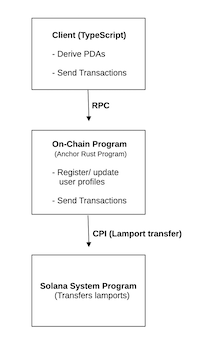
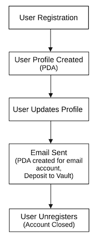

# Developer Documentation

This document provides an in-depth look at the **Solana Email Identity Service** project. It covers the architectural design, API reference, testing guidlines, and security considerations to ensure that my project meets professional quality standards.

## Table of Contents

- [Architecture](#Architecture)

    - [Overview](#Overview)

    - [Diagrams](#Diagrams)

    - [Technology Stack](#Technology-Stack)

- [API Reference](#API-Reference)

    - [registerUser](#registerUser)

    - [updateUser](#updateUser)

    - [unregisterUser](#unregisterUser)

    - [sendEmail](#sendEmail)

- [Testing Guidelines](#Testing-Guidelines)

    - [Test Strategy](#Test-Strategy)

    - [Test Isolation](#Test-Isolation)

    - [Running Tests](#Running-Tests)

- [Security Considerations](#Security-Considerations)

    - [Security Model](#Security-Model)

    - [Custom Error Handling](#Custom-Error-Handling)

    - [Recommendations](#Recommendations)

- [CI/CD Integration](#CI/CD-Integration)

- [Future Roadmap](#Future-Roadmap)

- [Conclusion](#Conclusion)

---

## Architecture

### Overview
The **Solana Email Identity Service** is a decentralized protocol built on the Solana blockchain using the Anchor framework. It manages user registration and profile management, and provides a mechanism for sending on-chain email metadata with a spam prevention deposit.

Key components include:

- **On-Chain Program**:

    Written in Rust using Anchor. The program implements instructions for user registration, profile updates, unregistration, and sending emails.

- **Program Derived Addresses (PDAs)**:

    Deterministic addresses derived for:

    - **User Profile:** `[b"user_profile", owner.key()]`

    - **Email Account:** `[b"email_account", sender.key()]`

    - **Vault:** `[b"vault"]`

- **Client Integration:**

    A TypeScript client interacts with the on-chain program to create transactions for registering users, updataing profiles, sending emails, etc.

### Diagrams

- **Component Interaction Diagram**:

    

- **Data Flow Diagram**:

    
---

### Technolgy Stack

- **Rust & Anchor**: For the on-chain program.

- **Solana CLI**: For deploying and interacting with the bockchain.

- **TypeScript & Node.js**: For client integration and testing.

- **GitHub Actions**: For CI/CD pipeline automation.
---

## API Reference

### registerUser

### updateUser

### unregisterUser

### sendEmail
---

## Testing Guidelines

### Test Strategy

### Test Isolation

### Running Tests
---

## Security Considerations

### Security Model

### Custom Error Handling

### Recommendations
---

## CI/CD Integration
---

## Future Roadmap
---

## Conclusion
---

## Glossary of Terms

**Client**: Refers to a piece of software that interacts with the Solana network e.g., a TypeScript listing.

**Program Derived Address (PDA)**: A type of address that is deterministically derived using a combination of user-defined seeds, a bump seed, and a program's ID. PDAs look like a standard public key but do not have corresponding private keys. This means that these addresses fall off of the Ed25519 curve and cannot be signed by an external user.

**Remote Procedure Call (RPC)**: A protocol that allows a client to request a service or data from a server, which is typically a node in the Solana network.

**Cross-Program Invocation (CPI)**: A mechanism that allows one Solana program to call another program, similar to how function calls work in traditional programming but CPIs opperate at the level of smart contracts within the Solana blockchain.

**Continuous Integration and Continuous Delivery/Deployment**: A set of practices in software engineering aimed at streamlining and accelerating the software development lifecycle. **Continuous Integration (CI)** is a practice where developers frequently merge their code changes into a central code repository (GitHub). **Contiuous Delivery (CD)** extends the CI process by ensuring that the software can be released to production at any time by automating building, testing, and packaging. **Continuous Deployment (CD)** is an advanced form of CD where every change that passes the automated testing is automatically deployed to production.
