# Developer Documentation

This document provides an in-depth look at the **Solana Email Identity Service** project. It covers the architectural design, API reference, testing guidlines, and security considerations to ensure that this project meets professional quality standards.

## Table of Contents

- [Architecture](#Architecture)

    - [Overview](#Overview)

    - [Diagrams](#Diagrams)

    - [Technology Stack](#Technology-Stack)

- [API Reference](#API-Reference)

    - [`registerUser`](#registerUser)

    - [`updateUser`](#updateUser)

    - [`unregisterUser`](#unregisterUser)

    - [`sendEmail`](#sendEmail)

- [Testing Guidelines](#Testing-Guidelines)

    - [Test Strategy](#Test-Strategy)

    - [Test Isolation](#Test-Isolation)

    - [Running Tests](#Running-Tests)

- [Security Considerations](#Security-Considerations)

    - [Security Model](#Security-Model)

    - [Security Auditing](#Security-Auditing)

    - [Recommendations](#Recommendations)

- [CI/CD Integration](#CI-CD-Integration)

- [Future Roadmap](#Future-Roadmap)

- [Conclusion](#Conclusion)

- [Glossary of Terms](#glossary-of-terms)

---

## Architecture

### Overview
The **Solana Email Identity Service** is a decentralized protocol built on the Solana blockchain using the Anchor framework. Its core functions include:

- **User Registration & Profile Management**:
    Creating and managing user profiles using Program Derived Addresses (PDAs).

- **On-Chain Email Metadata**:
    Loggin email metadata along with a spam prevention deposit to discourage abuse.

- **Secure Interactions**:
    Ensuring that only authorized users can update or unregister their profiles through enforced constraints.

### Diagrams

- **Component Interaction Diagram**:

    <br>
    **Figure 1**. Illustration of the interactions between the on-chain program, client, blockchain network and data storage.

- **Data Flow Diagram**:

    <br>
    **Figure 2**. Shows the flow of data between user actions, PDAs, and on-chain transactions.

<a href="#table-of-contents" title="Back to Table of Contents">⤴️</a>
---

### Technology Stack

- **Rust & Anchor**: For building the on-chain program (e.g., Anchor CLI v0.31.0, Rust v1.85.0).

- **Solana CLI**: For deploying and interacting with the bockchain.

- **TypeScript & Node.js**: For client integration and testing.

- **GitHub Actions**: For CI/CD pipeline automation.

<a href="#table-of-contents" title="Back to Table of Contents">⤴️</a>
---

## API Reference

### `registerUser`

- **Description**: 
    Registers a new user by creating a PDA-based user profile.

- **Accounts**:

    - `userProfile`: PDA derived from `[b"user_profile", owner.key()]`.

    - `owner`: The signer and payer.

    - `systemProgram`: The Solana System Program

- **Arguments**:

    None (defaults are set in the instruction).

- **Custom Errors**:

    - `UserAlreadyRegistered`: Returned if a user is already registered.

- **Example**:
```ts
const [userProfilePDA] = anchor.web3.PublicKey.findProgramAddressSync(
    [Buffer.from("user_profile), user.toBuffer()],
    program.programId
);
await program.methods.registerUser().accounts({
    userProfile: userProfilePda,
    owner: user,
    systemProgram: anchor.web3.SystemProgram.programId,
}).rpc();
```
- **Flowgram**:<br>


### `updateUser`

- **Description**: 
    Updates a user's profile (e.g., the display name). Only the profile owner can update their profile.

- **Accounts**:

    - `userProfile`: Mutable PDA (derived from `[b"user_profile", owner.key()]` ).

    - `owner`: The signer (must match `userProfile.owner`).

- **Arguments**:

    - `new_display_name: String`

- **Custom Errors**:

    - `Unauthorized`: Returned if the signer is not the owner.

    - `InputLengthExceeded`: (Optional) Returned if the new display name is too long.

- **Example**:
```ts
await program.methods.updateUser("Alice").accounts({
    userProfile: userProfilePda,
    owner: user,
}).rpc();
```

- **Flowgram**:


### `unregisterUser`

- **Description**:
    Closes the user profile account and transfers any remaining lamports to the owner.

- **Accounts**:

    - `userProfile`: Mutable PDA with the `close = owner` attribute.

    - `owner`: The signer.

- **Arguments**:

    None.

- **Custom Errors**:

    - `Unauthorized`: Returned if the signer does not match the owner.

-**Example**:
```ts
await protram.methods.unregisterUser().accounts({
    userProfile: userProfilePda,
    owner: user,
}).rpc();
```

### `sendEmail`

- **Description**:
    Sends an email by creating an on-chain email record and transferring a small deposit (spam prevention) from the sender to a vault.

- **Accounts**:

    - `sender`: The signer.

    - `emailAccount`: PDA derived from `[b"email_account", sender.key()]`.

    - `vault`: PDA for spam deposit (inialized if needed).

    - `systemProgram`: The Solana System Program.

- **Arguments**:

    None.

- **Custom Errors**:

    `TransferFailed`: Returned if the lamport transfer fails (e.g., insufficient funds).

- **Example**:
``ts
const [emailAccountPda] = anchor.web3.PublicKey.findProgramAddressSync(
    [Buffer.from("email_account"), sender.toBuffer()],
    program.programId
);
await program.methods.sendEmail().accounts({
    sender: sender,
    emailAccount: emailAccountPda,
    vault: vaultPda,
    systemProgram: anchor.web3.SystemProgram.programId,
}).rpc();

<a href="#table-of-contents" title="Back to Table of Contents">⤴️</a>
---

## Testing Guidelines

### Test Strategy
My test suite covers both **happy path** and **negative test** cases:

- **Happy Path Tests**:

    - Registering a new user.
    - Updating profile information.
    - Unregistering a user.
    - Sending an email with a spam prevention deposit.
    - Complete end-to-end user journey.

- **Negative Tests**:

    - Unauthorized updates.
    - Duplicate registrations.
    - Insufficient funds for email sending.
    - Input boundary conditions (e.g., excessively long display names).

- **Edge Cases**:

    Test empty or malformed inputs.

### Test Isolation

- **New Keypairs**:

    Each test generates new keypairs to ensure isolation, preventing interference between tests.

- **Airdrop Helper**:

    Helper function airdrops SOL to new keypairs to ensure they have sufficient funds.

- **Account Closure**:

    Use the `unregisterUser` instruction to clean up state and avoid conflicts between tests.

### Running Tests

To run the test suite locally:

1. **Deploy the Program**:

```bash
anchor clean && anchor build && anchor deploy
```

2. **Run Tests**:

```bash
yarn test
```

3. **Troubleshooting**:

    If tests fail due to network issues, consider restarting the local validator:
    ```bash
    solana-test-validator --reset
    ```

<a href="#table-of-contents" title="Back to Table of Contents">⤴️</a>
---

## Security Considerations

### Security Model

- **Authorization**:

    Use constraints (e.g., `has_one = owner`) to ensure that only authorized users can update or unregister accounts.

- **Custom Error Codes**:

    Define custom error codes using the `#[error_code]` macro. For example:

    ```rust
    #[error_code]
    pub enum ErrorCode {
        #[msg("Transfer of spam deposit failed.")]
        TransferFailed,
        #[msg("Unauthorized: Only the account owner can perform this action.")]
        Unauthorized,
        #[msg("User is already registered.")]
        UserAlreadyRegistered,
    }
    ```

    - **PDA Safety**:
    PDAs are derived using deterministic seeds and a bump value, ensuring tha they are not directly controlled by any external keypair.

- **Acount Data Storage**:

    Calculate account sizes precisely to avoid overflows and minimize on-chain storage costs.

- **CPI Safety**:

    When performing CPI calls (like transferring lamports), map errors to custom error codes for clarity.

### Security Auditing

- **Internal Code Reviews**:

    Regularly review code for common pitfalls (authorization checks, PDA derivation, account sizing).

- **Static Analysis**:

    Run `cargo clippy` for Rust and ESLint for TypeScript.

- **External Audit**:

    Engage a third-party auditor before mainnet deployment.

- **Dependency Management**:

    Keep dependencies up-to-date and monitor for security patches.

- **Documentation**:

    Maintain a security guide detailing your design decisions and known limitations.

### Recommendations

- Use automated security tools as part of the CI/CD pipeline.

- Update dependencies regularly and review change logs for security fixes.

- Document any deviations or assumptions in the security model.

<a href="#table-of-contents" title="Back to Table of Contents">⤴️</a>
---
<a id="ci-cd-integration"></a>
## CI/CD Integration

### GitHub Actions Workflow

Your CI/CD pipeline should automate the following:

- **Checkout the Repository**

    Retrieves the latest code from GitHub.

- **Set Up Toolchains**:
    
    Configures the Rust toolchain, Node.js, and Yarn environments.

- **Cache Dependencies**:

    Uses GitHub Actions caching for Cargo and Yarn to speed up builds.

- **Install CLI Tools**:

    Installs the Solana CLI and Anchor CLI.

- **Set Up Deployment Wallet**:

    Uses a GitHub secret (```DEPLOY_KEYPAIR```) to set up a fixed deployment wallet located at ```~/.config/solana/id.json``` and sets the ```ANCHOR_WALLET``` environment variable accordingly.

- **Build and Deploy**:

    Runs `anchor clean`, `anchor build`, and `anchor deploy` to compile and deploy the program.

- **Run Tests**:

    Executes the test suite (using `yarn test`) without re-deploying on every run.


Example GitHub Actions workflow file (`.gihub/workflows/ci/yml`):
```yaml
name: Anchor CI

on:
  push:
    branches: [ main ]
  pull_requests:
    branches: [ main ]
  workflow_dispatch:

jobs:
  build-and-tests:
    runs-on: ubuntu-latest
    steps:
      - name: Checkout repository
        uses: actions/checkout@v3

      - name: Set up Rust toolchain
        uses: actions-rs/toolchain@v1
        with:
          toolchain: stable
          override: true

      - name: Cache Cargo dependencies
        uses: actions/cache@v3
        with:
          path: ~/.cargo/registry
          key: ${{ runner.os }}-cargo-${{ hashFiles('**/Cargo.lock') }}

      - name: Cache Cargo git repositories
        uses: actions/cache@v3
        with:
          path: ~.cargo/git
          key: ${{ runner.os }}-cargo-git-${{ hashFiles('**/Cargo.lock') }}

      - name: Install Solana CLI
        run: |
          curl -sSfL https://release.solana.com/v1.18.2/jinstall | sh
          echo "$HOME/.local/share/solana/install/active_release/bin" >> $GITHUB_PATH

      - name: Set up Anchor Wallet from Secret
        run: |
          mkdir -p ~/.config/solana
          echo "$DEPLOY_KEYPAIR" > ~/.config/solana/id.json
          echo "ANCHOR_WALLET=~/.config/solana/id.json" >> $GITHUB_ENV
        env:
          DEPLOY_KEYPAIR: ${{ secrets.DEPLOY_KEYPAIR }}

      - name: Debug Fixed Keypair
        run: solana-keygen pubkey ~/.config/solana/id.json

      - name: Install Anchor CLI
        run: cargo install --git https://github.com/coral-xyz/anchor --tag v0.31.0 anchor-cli --locked --force

      - name: Set up Node
        uses: actions/setup-node@v3
        with:
          node-version: '18.x'

      - name: Cache Node dependencies
        uses: actions/cache@v3
        with:
          path: ~/.yarn/cache
          key: ${{ runner.os }}-yarn-${{ hashFiles('**/yarn.lock') }}

      - name: Install Node dependencies
        run: yarn install

      - name: Add node_modules/.bin to PATH
        run: echo "$(pwd)/node_modules/.bin" >> $GITHUB_PATH

      - name: Set SBF_RUSTC environment variable
        run: echo "SBF_RUSTC=$(which rustc)" >> $GITHUB_ENV

      - name: Build the Anchor program
        run: anchor build

      - name: Start Solana test validator
        run: |
          solana-test-validator --reset &
          sleep 20

      - name: Run tests
        run: anchor test --skip-local-validator
```

### How This Workflow Works (Step by Step)

1. **Checkout Repository**:
    The code is cloned from GitHub.

2. **Toolchain Setup**:
    The Rust toolchain is set up to ensure that all Rust commands use a consistent version.

3. **Dependency Caching**:
    Cargo registry and git repositories are cached to speed up future builds.

4. **Solana CLI Installation**:
    The Solana CLI installed using the official release command.

5. **Wallet Setup**:
    A fixed deployment wallet is set up using the ```DEPLOY_KEYPAIR``` GitHub Secret. this ensures that the same wallet is used across builds.

6. **Keypair Debugging**:
    The workflow prints the public key of the wallet to verify that the correct keypair is being used.

7. **Anchor CLI Installation**:
    Installs the Anchor CLI at the spcified version.

8. **Node Setup and Dependency Caching**:
    The Node.js environment is set up, and Yarn caches are used to optimize package installation.

9. **Build Process**:
    The Anchor program is built using ```anchor build```.

10. **Local Validator**:
    The Solana test validator is started with the ```--reset``` flag to ensure a clean environment. A short sleep ensures the validator is ready.

11. **Testing**:
    The test suite is run with ```anchor test --skip-local-validator```, which leverages the already running validator without re-deploying the program for every test run.

### Reliability Considerations

- ***Wallet Consistency**:
    Using a fixed deployment wallet from a secret ensures that the same keypair is used in every CI run, reducing mismatches.

- **Clean Environment**:
    Starting the test validator with ```--reset``` minimizes the chance of conflicts due to a leftover state from previous runs.

- **Caching**:
    Caching dependencies speeds up builds and reduces network-related failures.

- **Automated Environment Variables**:
    Setting environment variables (like ```SBF_RUSTC``` and ```ANCHOR_WALLET```) ensures thata all build and deploy commends use the correct configurations.

### Automated Notificaitons

Configure your CI system (e.g., GitHub Actions) to send notifications (via Discord, email, etc.) if builds or tests fail, ensuring prompt attention to issues.

<a href="#table-of-contents" title="Back to Table of Contents">⤴️</a>
---

## Future Roadmap

- **Enhanced Email Functionality**:
Integrate with decentralized storage (e.g., Arweave) for off-chain email content.

- **Encryption**:
Implement end-to-end encryption for secure email communication.

- **Advance Spam Filtering & Token Rewards**:
Develop token-based incentives and customizable spam filters, and explore cross-chain interoperability with networks like Ethereum and Polkadot.

- **UI Integration**:
Build a web-based interface for composing, sending, and receiving emails.

- **Additional Profile Information**:
Expand the `UserProfile` struct to include full name, recovery options, and avatar pointers (with off-chain storage as needed).

<a href="#table-of-contents" title="Back to Table of Contents">⤴️</a>
---

## Conclusion

This document outlines the architecture, API, testing, security, and CI/CD practices for the Solana Email Identity Service. By adhering to these guidelines, the project is built to high professional standards, ensuring reliability, security, and maintainability. As the project evolves, this document should be updated to reflect new features and improvements.

<a href="#table-of-contents" title="Back to Table of Contents">⤴️</a>
---

## Glossary of Terms

**Client**: Software that interacts with the Solana network (e.g., a TypeScript client).

**Program Derived Address (PDA)**: A deterministic address derived using user-defined seeds and a bump seed, controlled exclusively by the on-chain program.

**Remote Procedure Call (RPC)**: A protocol for requesting services or data from a server (blockchain node).

**Cross-Program Invocation (CPI)**: The mechanism that allows one Solana program to call another.

**Continuous Integration and Continuous Delivery/Deployment (CI/CD)**: Continuous Integration and Continuous Deployment/Delivery practices that automate the software development process.

**Solana System Program**: The native program responsible for account management and fund transfers on the Solana blockchain.


<a href="#table-of-contents" title="Back to Table of Contents">⤴️</a>