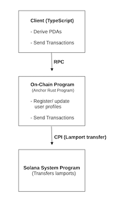
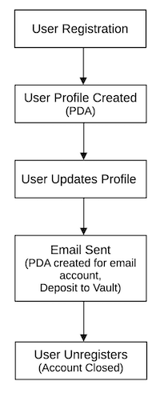

# Phase 1 Handoff Document - Solana Email Identity Service

This document serves as the handoff for Phase 1 of the Solana Email identity Service project. It summarises the current status of the project, including architecture, key features, testing, CI/CD integration, and security considerations. This handoff is intended to provide the Phase 2 team with a comprehensive understanding of the work completed so far, as well as guidance on areas that may need further development.

---

## 1. Project Overview

**Solana Email Identity Service** is a decentralized protocol built on the Solana blockchain using the Anchor framework. The project provides a secure foundation for:

- **User Registration**: Creation of PDA-based user profiles.
- **Profile Management**: Update of user profile details (e.g., display name).
- **Unregistration**: Closing user profiles and reclaiming lamports.
- **Email Sending**: Loggin on-chain email metadata along with a small spam prevention deposit.

---

## 2. Architectural Overview

### 2.1 Key Components

- **On-chain Program (Rust/Anchor)**:
  Implements all instructions for user registration, profile updates, unregistration, and email sending. PDAs are derived from fixed seeds (e.g., `user_profile`, `email_account`, and `vault`).

- **Client Integration (TypeScript/Node.js)**:
  A TypeScript client interacts with the on-chain program to issue transactions and run comprehensive tests.

- **CI/CD Pipeline**:
  GitHub Actions are used to automate building, deploying, and testing. The workflow includes static analysis (Cargo Clippy for Rust and ESLint for TypeScript) and tests on each commit/ PR.

### 2.2 Diagrams

- **Component Interaction Diagram**:
  
  **Figure 1**. Illustrates the interaction between the on-chain program, client, and blockchain network.

- **Data Flow Diagram**:
  
  **Figure 2**. Shows the flow of data between user actions, PDAs, and on-chain transactions.

---

## Completed Work in Phase 1

- **Core Functionality**:

  - PDA-based user registration and profile management.
  - Unregistration (account closure) with lamport transfer.
  - On-chain email metadata logging with spam prevention deposit.

- **Testing**:

  - Comprehensive unit and integration tests covering positive and negative scenarios.
  - Automated testing via GitHub Actions.

- ** CI/CD Integration**:

  - GitHub Actions workflow configured for building, deploying, and testing.
  - Automated linting using Cargo Clippy and ESLint.

- **Documentation**:
  - Detailed README, Developer Guide, and Security Guide have been completed.
  - API references for all on-chain instructions.

-**Security Best Practices**: - Authorization constraints (e.g, `has_one = owner`). - Custom error codes for clear failure messaging. - Static analysis and regular dependency updates.

---

## Pending Tasks and Recommendations

### 4.1 Finalization for Phase 1

- **Code Quality\*\***:

  - Ensure all linting (both Rust and TypeScript) is error-free.
  - Review and finalize all tests for consistent test coverage.

- **CI/CD Improvements**:

  - Fine-tune GitHub Actions workflows to reduce deployment issues.
  - Address any remaining issues with keypair handling and program ID consistency.

- **Documentation Enhancements**:
  - Finalize the Developer Guide with any additional architectural diagrams.
  - Update the Security Guide with the latest recommendations and known limitations.
  - Prepare a detailed Handoff Document (this document) summarizing the current state and outlining next steps.

### 4.2 Recommendations for Phase 2

- **Feature Enhancements**:

  - Expand the user profile data to include additional fields (full name, recovery email, avatar, etc.).
  - Implement cros-chain compatibility and integration with decentralized storage (e.g., Arweave, Metaplex, or IPFS) for off-chain email content.
  - Explore advanced spam filtering and incentive mechanisms (tokenomics)

- **UI/UX Development**:

  - Develop a user-friendly web and/ or mobile client interface for composing, sending, and receiving emails.

- **Security Audits**:

  - Engage a third-party security auditor to review the code base before mainnet deployment.
  - Implement continuous monitoring and scheduled security reviews.

- **Scalability and Performance**:
  - Optimize on-chain data storage and transaction efficiency.
  - Evaluate and plan for scaling the solution as user adoption increases.

---

## 5. Handoff Checklist

Before handing off Phase 1, ensure the following:

- ⬜️ All unit and integration tests are passing locally and in CI.

- ⬜️ CI/CD pipelines (GitHub Actions) are stable and reproducible.

- ⬜️ Documentation (README, Developer Guide, Security Guide) is complete and reviewed.

- ⬜️ Code has been reviewed and linted with Cargo Clippy and ESLint.

- ⬜️ A comprehensive changelog has been maintained.

- ⬜️ Dependencies are updated and compatible with the target toolchains.

- ⬜️ The project is deployed on a testnet with a fixed program ID that is consistent across the codebase.

---

## 6. Conclusion

Phase 1 of the **Solana Email Identity Service** has established a robust foundation for a decentralized email system on Solana. The project meets professional standards with comprehensive testing, CI/CD integration, and detailed documentation. The Phase 2 team is encouraged to build upon this foundation to enhance features, integreate UI components, and further strengthen the system's security and scalability.

For further details, please refer to the [Developer Guide](./DEVELOPER_GUIDE.md) and [Security Guide](./SECURITY_GUIDE.md).
For questions or further discussions, contact the Phase 1 team at [rgmelvinphd@gmail.com](mailto:rgmelvinphd@gmail.com).

---

_This document is maintained by the Phase 1 team. All contributions and revisions should be documented in the project's changelog._
